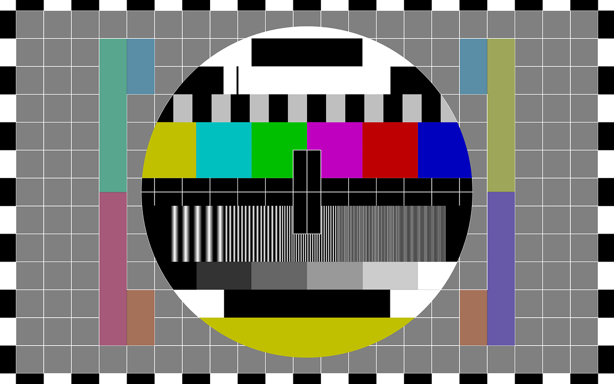

# <b>Package Name</b>

Picture of hardware (Especially useful, if it is custom made!)



**File Must be in the same folder as package or in a doc folder inside the package folder, then use ./doc/picturename.png**

## <b>Description</b>

Description of the package, what is it used for, sensor interface etc.

## Build Instructions/Requirements

* List of required modules (Python modules fx. and code or guide on how to install them)

## Topics:
### Published:

* `topicName`:
  Publishes `messageType` with what data.

### Subscribed:


## Parameters/Reconfigs:
*  `parameter1`: Description of parameter, with following options:
    * **option1 (Default)**
    * option2
    * option3
* `parameter2`: Description of parameter.

## Messeages:
* `Num`:
    * std_msgs/Header header
        * uint32 seq
        * time stamp
        * string frame_id
    * int64 num


## Launch Information

Description on how to launch the file (Launch file example and rosrun):

Launch using

```
<node type="" pkg="" name="">
  <param name="parameter1" value=""/>
  <param name="parameter2" value=""/>
  <remap from="topicName" to="newTopicName" />
</node>
```

in a launch file or using

`rosrun ...`

## Troubleshooting

How to fix known issues

## Contributors 

* Current maintaner: FirstName LastName (contact:email@aau.dk)

## Helpful Resources

* http://www.google.com
